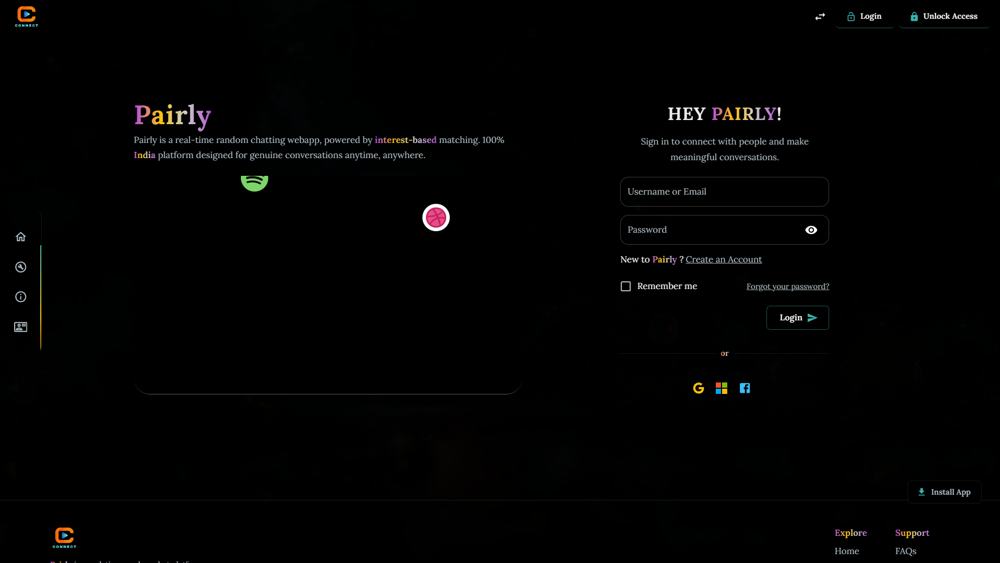
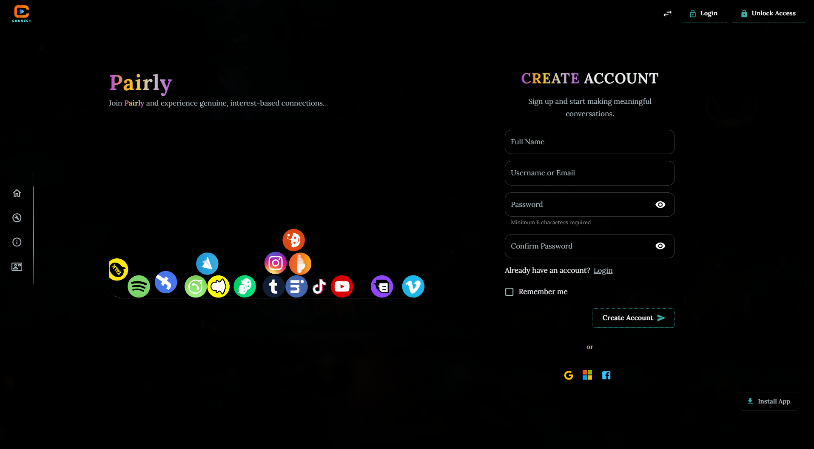
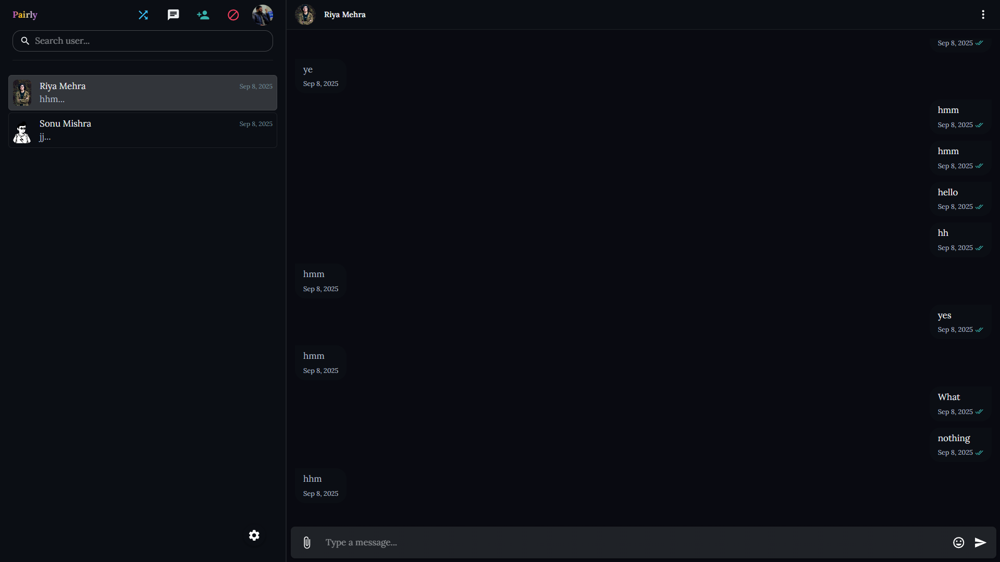

---

# Pairly – Open-Source Real-Time Chat Platform (Random + Private)

[](./LICENSE)
[](./CONTRIBUTING.md)


A full-stack real-time chat application that connects users anonymously for private 1-on-1 messaging. Built with **React**, **Node.js**, **Express**, **Socket.IO**, and **MongoDB**.

> **📢 Project Status**: This project was previously made private but is **now publicly available again** as an actively maintained open-source project. We're committed to transparency and community-driven development. Previously had **29 stars** and **17 forks**—thank you for your continued support!

---

#### _Read docs in other languages._

<kbd>[](docs/translations/README.id.md)</kbd>
<kbd>[](docs/translations/README.es.md)
</kbd>

---

## 📚 Table of Contents

- [Preview](#preview)
- [Features](#features)
- [Prerequisites](#prerequisites)
- [Setup Instructions](#setup-instructions)
- [Tech Stack](#tech-stack)
- [Project Structure](#project-structure)
- [Deployment](#deployment)
- [Contributing](#contributing)
- [Transparency & Trust](#-transparency--trust)
- [Made by Contributors](#-made-by-contributors)
- [Acknowledgements](#-acknowledgements)
- [Contact](#-contact)
- [License](#-license)

---

## 🖼️ Preview

| Login Page                          | Sign Up                              | App Page                           |
| ----------------------------------- | ------------------------------------ | ---------------------------------- |
|  |  |  |

---

## 🚀 Features

Pairly operates on a **freemium model** with core features available to all users and premium features for subscribers. This allows us to maintain the project sustainably while keeping the core chat experience free and open-source.

### ✅ Free Features

- 🔐 Secure User Authentication (Login/Signup)
- 🎲 Random One-to-One Private Chat
- 📡 Real-time Messaging with Socket.IO
- 📜 Chat History Persistence using MongoDB
- ✏️ Typing Indicator
- 🛡️ Protected Routes for Logged-in Users
- 🕒 Timestamped Messages
- 📱 Fully Responsive UI (Mobile & Desktop)
- 🔔 Basic Notifications

### 💎 Premium Features

- ⭐ Priority Support
- 🎨 Custom Themes & Personalization
- 📸 Advanced Media Sharing
- 🔐 Enhanced Privacy Controls
- 📱 PWA App Installation

**Contributing Note:** Contributors are welcome to work on both free and premium features. The codebase is fully open-source under the MIT License, and both tiers benefit from community improvements!

---

## 📦 Prerequisites

Make sure you have the following installed before starting:

- [Node.js](https://nodejs.org/) (v18 or later)
- [Git](https://git-scm.com/)
- A [MongoDB Atlas](https://www.mongodb.com/cloud/atlas) account (or use local MongoDB)

  **Need help setting up MongoDB Atlas?** Follow this guide: [Deploy a Free Cluster](https://www.mongodb.com/docs/atlas/tutorial/deploy-free-tier-cluster/)

After deploying a cluster:

1.  Click **Connect** → **Drivers**
2.  Select **Node.js** as the driver
3.  Copy the connection string and use it for `MONGO_URI` in `.env`

Example connection string:

```

MONGO_URI=mongodb+srv://<username>:<password>@cluster0.mongodb.net/?retryWrites=true&w=majority

```

---

## ⚙️ Setup Instructions

Follow these steps to run the app locally:

### 1. Clone the Repository

```bash
git clone https://github.com/behan05/pairly.git
cd pairly
```

---

### 2. Set Up the Backend

Navigate into the server directory:

```bash
cd pairly-server
```

Install dependencies:

```bash
npm install
```

Create an environment file:

```bash
cp .env.example .env
```

Open the `.env` file and configure:

```env
PORT=5000
MONGO_URI=your_mongo_db_uri_here
JWT_SECRET=your_jwt_secret_here
```

Start the backend server:

```bash
npm start
```

You should see logs like:

```
Server running on port 5000...
Connected to MongoDB
```

---

### 3. Set Up the Frontend

In a new terminal window/tab:

```bash
cd pairly-ui
npm install
npm run dev
```

The app will open at: [http://localhost:5173/](http://localhost:5173)

---

## 🧯 Troubleshooting

Common issues and solutions:

- **MongooseServerSelectionError**: Double-check your MongoDB URI and internet connection.
- **Port already in use**: Change the `PORT` value in `.env`, or stop the conflicting process.
- **Frontend doesn’t load**: Ensure backend server is running correctly.

---

## 🧱 Tech Stack

**Frontend:**

- ⚛️ React + Vite
- 💅 Material UI (MUI)
- 🔁 React Router
- 📦 Redux or Context API
- 📢 Toastify
- 🌐 Socket.IO Client

**Backend:**

- 🟩 Node.js + Express
- 🛢️ MongoDB + Mongoose
- 🔐 JWT for Authentication
- 🔒 bcrypt for Hashing
- 📡 Socket.IO for Real-Time Comm

---

## 📁 Project Structure

```
pairly/
├── pairly-ui/                          # Frontend React Application
│   ├── src/
│   │   ├── api/                        # API service calls
│   │   ├── assets/                     # Images, fonts, static assets
│   │   ├── components/                 # Reusable React components
│   │   ├── context/                    # Context API setup
│   │   ├── features/                   # Feature-specific modules
│   │   ├── layouts/                    # Layout components
│   │   ├── middleware/                 # Custom middleware
│   │   ├── MUI/                        # Material-UI customizations
│   │   ├── pages/                      # Page components
│   │   ├── redux/                      # Redux store & slices
│   │   ├── routes/                     # Route definitions
│   │   ├── services/                   # Service functions
│   │   ├── styles/                     # Global styles
│   │   ├── utils/                      # Utility functions
│   │   ├── installPrompt/              # PWA install prompt
│   │   ├── SubscriptionManager/        # Subscription handling
│   │   ├── App.jsx                     # Main App component
│   │   └── main.jsx                    # Entry point
│   ├── public/
│   │   ├── manifest.json               # PWA manifest
│   │   ├── robots.txt                  # SEO robots config
│   │   ├── service-worker.js           # Service worker
│   │   ├── messageTone/                # Message audio files
│   │   └── sounds/                     # Sound effects
│   ├── vite.config.js
│   ├── eslint.config.js
│   ├── package.json
│   └── README.md
│
├── pairly-server/                      # Backend Express Application
│   ├── controllers/
│   │   ├── authController.js
│   │   ├── profileController.js
│   │   ├── settingsController.js
│   │   ├── adminPanelControllers/      # Admin management
│   │   ├── feedbackControllers/        # User feedback
│   │   ├── paymentControllers/         # Payment processing
│   │   ├── privateChatControllers/     # Private chat logic
│   │   ├── randomChatControllers/      # Random chat matching
│   │   ├── searchUserControllers/      # User search
│   │   ├── support-ticket/             # Support tickets
│   │   └── common/                     # Shared controller logic
│   │
│   ├── models/
│   │   ├── User.model.js               # User schema
│   │   ├── Profile.model.js            # User profile
│   │   ├── settings.model.js           # User settings
│   │   ├── LoginActivity.model.js      # Login tracking
│   │   ├── UserActivity.model.js       # User activity logs
│   │   ├── ReportProblem.model.js      # Problem reports
│   │   ├── SupportTicket.model.js      # Support tickets
│   │   ├── admin/                      # Admin-related models
│   │   ├── chat/                       # Chat-related models
│   │   ├── feedback/                   # Feedback models
│   │   ├── payment/                    # Payment models
│   │   └── proposal/                   # Proposal models
│   │
│   ├── routers/
│   │   ├── profileRoutes.js
│   │   ├── settingsRoutes.js
│   │   ├── admin/                      # Admin routes
│   │   ├── auth/                       # Authentication routes
│   │   ├── chat/                       # Chat routes
│   │   ├── feedback/                   # Feedback routes
│   │   ├── payment/                    # Payment routes
│   │   └── searchUsers/                # Search routes
│   │
│   ├── middlewares/
│   │   ├── authMiddleware.js           # JWT authentication
│   │   ├── adminAuthMiddleware.js      # Admin authorization
│   │   ├── multerMiddleware.js         # File upload handling
│   │   ├── uploadPrivateMedia.js       # Private chat media upload
│   │   ├── uploadRandomMedia.js        # Random chat media upload
│   │   └── uploadProfileS3.js          # S3 profile upload
│   │
│   ├── sockets/
│   │   ├── socketServer.js             # Main socket configuration
│   │   ├── privateChat/                # Private chat socket events
│   │   └── randomChat/                 # Random chat socket events
│   │
│   ├── config/
│   │   ├── db.js                       # MongoDB connection
│   │   ├── passport/                   # OAuth strategies
│   │   │   ├── passportGithub.js
│   │   │   └── passportGoogle.js
│   │   └── razorpay/
│   │       └── razorpay.js             # Razorpay integration
│   │
│   ├── utils/
│   │   ├── generateToken.js
│   │   ├── aws/                        # AWS S3 utilities
│   │   ├── email/                      # Email service
│   │   └── socket/                     # Socket utilities
│   │
│   ├── cron/
│   │   ├── cleanupUnverifiedUsers.cron.js
│   │   └── deleteRandomExpiredMessages.cron.js
│   │
│   ├── tests/
│   │   ├── unit/                       # Unit tests
│   │   └── integration/                # Integration tests
│   │
│   ├── server.js                       # Main server entry
│   └── package.json
│
├── docs/
│   ├── screenshot/                     # App screenshots
│   └── translations/
│       ├── README.en.md                # English docs
│       ├── README.es.md                # Spanish docs
│       └── README.id.md                # Indonesian docs
│
├── CODE_OF_CONDUCT.md                  # Community guidelines
├── CONTRIBUTING.md                     # Contribution guide
├── LICENSE                             # MIT License
└── README.md                           # This file
```

---

## 🚀 Deployment

- **Frontend**: [Vercel](https://pairly.chat/)
- **Backend**: Render

---

## 🤝 Contributing

### Thinking of contributing?

Don't worry if you're new to open source — we're happy to help guide you! 😄
Just open an issue or comment on one you'd like to tackle.

### About Our Freemium Model

Pairly supports both **free and premium features**. All contributions are welcome, whether you're:
- 🆓 Improving free features that benefit all users
- 💎 Building premium features for subscribers
- 🔧 Fixing bugs or improving performance for everyone

The entire codebase is open-source under the MIT License. Contributors get credit for their work regardless of which tier they contribute to!

### We welcome contributions!

If you're new to open source, here are some good first issues:

### 🔧 Good First Tasks:

- Improve error messages or user feedback
- Setup GitHub Actions for CI
- Add unit tests or end-to-end tests
- Improve accessibility
- Write documentation

### Steps to contribute:

- 🌱 Fork this repo
- 🛠️ Create your feature branch
- 🔃 Submit a Pull Request
- ❤️ Don't forget to star the project!

Be sure to read the [contributing guide](CONTRIBUTING.md) if available.

---

## � Transparency & Trust

We understand that making a project private and then public again may raise concerns. Here's what we want you to know:

### Why Did We Go Private?
- We needed time to restructure the codebase and improve stability
- We wanted to ensure the project was production-ready
- We were evaluating the best path forward for long-term maintenance

### Why We're Back & Committed
- **100% Open Source**: All code is publicly visible and auditable
- **Active Maintenance**: The project is actively maintained and updated regularly
- **Community-Driven**: We welcome feedback, issues, and pull requests from the community
- **Clear Roadmap**: We're committed to transparent development practices
- **MIT License**: You can use, modify, and distribute this software freely

### Moving Forward
- All future development will be in the open
- We'll maintain regular communication through issues and discussions
- Security and stability are our top priorities
- Your feedback and contributions directly shape the project's future

---

## �🙏 Made by Contributors

We are grateful to all contributors who make this better every day.
Add yourself in `CONTRIBUTORS.md` when you contribute!

---

## ❤️ Acknowledgements

Thanks to all contributors and open-source libraries used in this project.
This project wouldn't be possible without them!

---

## 📬 Contact

For questions or contributions, feel free to reach out:
✉️ [behankrbth@outlook.com](mailto:behankrbth@outlook.com)

---

## 📄 License

This project is licensed under the [MIT License](./LICENSE)
