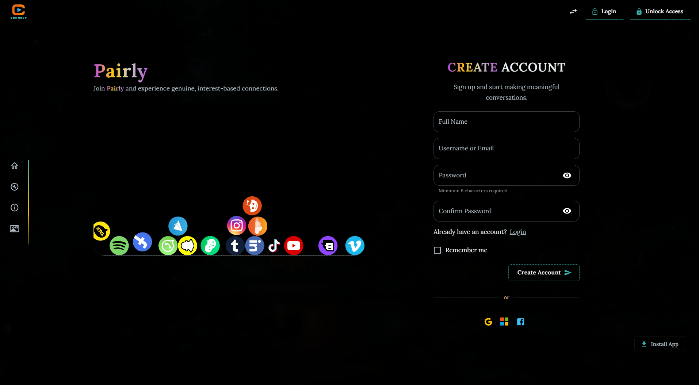
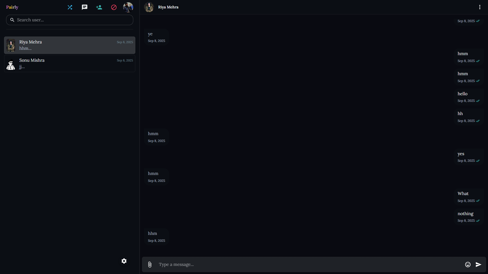

---

# Pairly – Platform Chat Waktu Nyata Sumber Terbuka (Acak + Pribadi) 🇮🇩

[](./LICENSE)
[](#kontribusi)


Aplikasi chat full-stack waktu nyata yang menghubungkan pengguna secara anonim untuk pesan pribadi 1-ke-1. Dibangun dengan **React**, **Node.js**, **Express**, **Socket.IO**, dan **MongoDB**.

> **📢 Status Proyek**: Proyek ini sebelumnya dibuat pribadi tetapi **sekarang tersedia untuk publik lagi** sebagai proyek sumber terbuka yang aktif dirawat. Kami berkomitmen pada transparansi dan pengembangan yang didorong komunitas. Sebelumnya memiliki **29 bintang** dan **17 garpu**—terima kasih atas dukungan berkelanjutan Anda!

---

## 📚 Daftar Isi

* [Pratinjau](#️-pratinjau)
* [Fitur](#-fitur)
* [Prasyarat](#-prasyarat)
* [Langkah Instalasi](#️-langkah-instalasi)
* [Teknologi Digunakan](#-teknologi-digunakan)
* [Struktur Proyek](#-struktur-proyek)
* [Deployment](#-deployment)
* [Kontribusi](#-kontribusi)
* [Transparansi & Kepercayaan](#-transparansi--kepercayaan)
* [Dibuat oleh Kontributor](#️-dibuat-oleh-kontributor)
* [Penghargaan](#️-penghargaan)
* [Kontak](#-kontak)
* [Lisensi](#-lisensi)

---

## 🖼️ Pratinjau

| Halaman Login                                  | Daftar Akun                                     | Halaman Aplikasi                              |
| ---------------------------------------------- | ----------------------------------------------- | --------------------------------------------- |
|  |  |  |

---

## 🚀 Fitur

### ✅ Fitur Gratis

* 🔐 Autentikasi Pengguna (Login/Daftar)
* 💬 Pesan Privat satu-ke-satu
* 📡 Pembaruan Pesan Waktu Nyata dengan Socket.IO
* 📜 Riwayat Chat Persisten (MongoDB)
* ✏️ Indikator Mengetik (Opsional)
* 📱 Antarmuka Responsif & UX modern
* 🛱‍♂️ Rute Terproteksi untuk Pengguna Tertentu
* 🕒 Pesan dengan Timestamp
* 🔔 Notifikasi Dasar

### 💎 Fitur Premium

* ⭐ Dukungan Prioritas
* 🎎 Tema Khusus & Personalisasi
* 📸 Berbagi Media Lanjutan
* 🔐 Kontrol Privasi yang Ditingkatkan
* 📊 Analitik & Wawasan Pengguna
* 📱 Instalasi Aplikasi PWA

---

## 📦 Prasyarat

Pastikan kamu telah menginstal:

* [Node.js](https://nodejs.org/) (versi 18 atau lebih baru)
* [Git](https://git-scm.com/)
* Akun [MongoDB Atlas](https://www.mongodb.com/cloud/atlas) (atau MongoDB lokal)

> **Butuh bantuan setup MongoDB Atlas?** Ikuti panduan ini: [Deploy Cluster Gratis](https://www.mongodb.com/docs/atlas/tutorial/deploy-free-tier-cluster/)
>
> Setelah deploy:
>
> 1. Klik **Connect** → **Drivers**
> 2. Pilih **Node.js** sebagai driver
> 3. Salin string koneksi dan gunakan pada `MONGO_URI` di file `.env`

Contoh string koneksi:

```
MONGO_URI=mongodb+srv://<username>:<password>@cluster0.mongodb.net/?retryWrites=true&w=majority
```

---

## ⚙️ Langkah Instalasi

Ikuti langkah berikut untuk menjalankan aplikasi secara lokal:

### 1. Clone Repositori

```bash
git clone https://github.com/behan05/real-time-chat-app.git
cd real-time-chat-app
```

---

### 2. Siapkan Backend

Masuk ke direktori server:

```bash
cd connect-server
```

Instal dependensi:

```bash
npm install
```

Buat file environment:

```bash
cp .env.example .env
```

Edit file `.env` dan isi:

```env
PORT=5000
MONGO_URI=isi_mongo_uri_kamu
JWT_SECRET=isi_jwt_secret_kamu
```

Jalankan server backend:

```bash
npm start
```

Kamu akan melihat log seperti:

```
Server running on port 5000...
Connected to MongoDB
```

---

### 3. Siapkan Frontend

Buka terminal baru:

```bash
cd ../connect-ui
npm install
npm run dev
```

Aplikasi akan berjalan di: [http://localhost:5173/](http://localhost:5173)

---

## 🧯 Pemecahan Masalah

Beberapa masalah umum dan solusinya:

* **MongooseServerSelectionError**: Periksa kembali URI MongoDB dan koneksi internet.
* **Port sedang digunakan**: Ganti nilai `PORT` di `.env`, atau hentikan proses yang bentrok.
* **Frontend tidak muncul**: Pastikan backend berjalan dengan benar.

---

## 🧱 Teknologi Digunakan

**Frontend:**

* ⚛️ React + Vite
* 💅 Material UI (MUI)
* 🔁 React Router
* 📦 Redux atau Context API
* 📢 Toastify
* 🌐 Socket.IO Client

**Backend:**

* 🟩 Node.js + Express
* 🛢️ MongoDB + Mongoose
* 🔐 JWT untuk Autentikasi
* 🔒 bcrypt untuk Enkripsi
* 📡 Socket.IO untuk komunikasi real-time

---

## 📁 Struktur Proyek

```
pairly/
├── pairly-ui/                          # Aplikasi Frontend React
│   ├── src/
│   │   ├── api/                        # Panggilan layanan API
│   │   ├── assets/                     # Gambar, font, aset statis
│   │   ├── components/                 # Komponen React yang dapat digunakan kembali
│   │   ├── context/                    # Setup Context API
│   │   ├── features/                   # Modul khusus fitur
│   │   ├── layouts/                    # Komponen tata letak
│   │   ├── middleware/                 # Middleware kustom
│   │   ├── MUI/                        # Kustomisasi Material-UI
│   │   ├── pages/                      # Komponen halaman
│   │   ├── redux/                      # Penyimpanan Redux & slices
│   │   ├── routes/                     # Definisi rute
│   │   ├── services/                   # Fungsi layanan
│   │   ├── styles/                     # Gaya global
│   │   ├── utils/                      # Fungsi utilitas
│   │   ├── installPrompt/              # Prompt instalasi PWA
│   │   ├── SubscriptionManager/        # Pengelolaan langganan
│   │   ├── App.jsx                     # Komponen aplikasi utama
│   │   └── main.jsx                    # Titik masuk
│   ├── public/
│   │   ├── manifest.json               # Manifes PWA
│   │   ├── robots.txt                  # Konfigurasi robot SEO
│   │   ├── service-worker.js           # Service worker
│   │   ├── messageTone/                # File audio pesan
│   │   └── sounds/                     # Efek suara
│   ├── vite.config.js
│   ├── eslint.config.js
│   ├── package.json
│   └── README.md
│
├── pairly-server/                      # Aplikasi Backend Express
│   ├── controllers/
│   │   ├── authController.js
│   │   ├── profileController.js
│   │   ├── settingsController.js
│   │   ├── adminPanelControllers/      # Manajemen admin
│   │   ├── feedbackControllers/        # Umpan balik pengguna
│   │   ├── paymentControllers/         # Pemrosesan pembayaran
│   │   ├── privateChatControllers/     # Logika obrolan pribadi
│   │   ├── randomChatControllers/      # Pencocokan obrolan acak
│   │   ├── searchUserControllers/      # Pencarian pengguna
│   │   ├── support-ticket/             # Tiket dukungan
│   │   └── common/                     # Logika kontroler bersama
│   │
│   ├── models/
│   │   ├── User.model.js               # Skema pengguna
│   │   ├── Profile.model.js            # Profil pengguna
│   │   ├── settings.model.js           # Pengaturan pengguna
│   │   ├── LoginActivity.model.js      # Pelacakan login
│   │   ├── UserActivity.model.js       # Log aktivitas pengguna
│   │   ├── ReportProblem.model.js      # Laporan masalah
│   │   ├── SupportTicket.model.js      # Tiket dukungan
│   │   ├── admin/                      # Model terkait admin
│   │   ├── chat/                       # Model terkait obrolan
│   │   ├── feedback/                   # Model umpan balik
│   │   ├── payment/                    # Model pembayaran
│   │   └── proposal/                   # Model proposal
│   │
│   ├── routers/
│   │   ├── profileRoutes.js
│   │   ├── settingsRoutes.js
│   │   ├── admin/                      # Rute admin
│   │   ├── auth/                       # Rute autentikasi
│   │   ├── chat/                       # Rute obrolan
│   │   ├── feedback/                   # Rute umpan balik
│   │   ├── payment/                    # Rute pembayaran
│   │   └── searchUsers/                # Rute pencarian
│   │
│   ├── middlewares/
│   │   ├── authMiddleware.js           # Autentikasi JWT
│   │   ├── adminAuthMiddleware.js      # Otorisasi admin
│   │   ├── multerMiddleware.js         # Penanganan unggah file
│   │   ├── uploadPrivateMedia.js       # Unggah media obrolan pribadi
│   │   ├── uploadRandomMedia.js        # Unggah media obrolan acak
│   │   └── uploadProfileS3.js          # Unggah profil S3
│   │
│   ├── sockets/
│   │   ├── socketServer.js             # Konfigurasi soket utama
│   │   ├── privateChat/                # Acara soket obrolan pribadi
│   │   └── randomChat/                 # Acara soket obrolan acak
│   │
│   ├── config/
│   │   ├── db.js                       # Koneksi MongoDB
│   │   ├── passport/                   # Strategi OAuth
│   │   │   ├── passportGithub.js
│   │   │   └── passportGoogle.js
│   │   └── razorpay/
│   │       └── razorpay.js             # Integrasi Razorpay
│   │
│   ├── utils/
│   │   ├── generateToken.js
│   │   ├── aws/                        # Utilitas AWS S3
│   │   ├── email/                      # Layanan email
│   │   └── socket/                     # Utilitas soket
│   │
│   ├── cron/
│   │   ├── cleanupUnverifiedUsers.cron.js
│   │   └── deleteRandomExpiredMessages.cron.js
│   │
│   ├── tests/
│   │   ├── unit/                       # Tes unit
│   │   └── integration/                # Tes integrasi
│   │
│   ├── server.js                       # Masuk utama server
│   └── package.json
│
├── docs/
│   ├── screenshot/                     # Tangkapan layar aplikasi
│   └── translations/
│       ├── README.en.md                # Dokumentasi bahasa Inggris
│       ├── README.es.md                # Dokumentasi bahasa Spanyol
│       └── README.id.md                # Dokumentasi bahasa Indonesia
│
├── CODE_OF_CONDUCT.md                  # Pedoman komunitas
├── CONTRIBUTING.md                     # Panduan kontribusi
├── LICENSE                             # Lisensi MIT
└── README.md                           # File ini
```

---

## 🚀 Deployment

* **Frontend**: \[[Vercel](https://connect-link-three.vercel.app/)]\([https://connect-link-three.vercel.app](https://connect-link-three.vercel.app))
* **Backend**: Render

---

## 🤝 Kontribusi

### Ingin berkontribusi?

Jangan khawatir jika kamu baru di open source — kami dengan senang hati akan membimbingmu! 😄
Cukup buka issue atau komentar pada salah satu yang ingin kamu kerjakan.

### Kami menyambut semua kontribusi!

Jika kamu baru memulai, berikut beberapa tugas pertama yang bagus:

### 🔧 Tugas Pertama yang Cocok

* Perbaiki pesan error atau feedback pengguna
* Setup GitHub Actions untuk CI
* Tambahkan unit test atau end-to-end test
* Tingkatkan aksesibilitas
* Tulis dokumentasi

### Langkahnya:

* 🌱 Fork repo ini
* 🛠️ Buat branch baru untuk fiturmu
* 🔃 Kirim Pull Request
* ❤️ Jangan lupa ⭐ repo ini ya!

Baca juga [panduan kontribusi](CONTRIBUTING.md) jika tersedia.

---

## 🔐 Transparansi & Kepercayaan

Kami memahami bahwa membuat proyek pribadi dan kemudian membuatnya publik lagi mungkin menimbulkan kekhawatiran. Inilah yang ingin kami sampaikan:

### Mengapa Kami Membuatnya Pribadi?
- Kami membutuhkan waktu untuk menstruktur ulang kode dan meningkatkan stabilitas
- Kami ingin memastikan proyek siap untuk produksi
- Kami mengevaluasi jalan terbaik untuk pemeliharaan jangka panjang

### Mengapa Kami Kembali & Berkomitmen?
- **100% Open Source**: Semua kode terlihat dan dapat diaudit publik
- **Pemeliharaan Aktif**: Proyek dirawat secara aktif dan diperbarui secara teratur
- **Didorong Komunitas**: Kami menyambut feedback, issues, dan pull request dari komunitas
- **Roadmap Jelas**: Kami berkomitmen pada praktik pengembangan yang transparan
- **Lisensi MIT**: Anda dapat menggunakan, memodifikasi, dan mendistribusikan perangkat lunak ini dengan bebas

### Ke Depannya
- Semua pengembangan di masa depan akan dilakukan secara terbuka
- Kami akan menjaga komunikasi reguler melalui issues dan diskusi
- Keamanan dan stabilitas adalah prioritas utama kami
- Feedback dan kontribusi Anda secara langsung membentuk masa depan proyek

---

## ❤️ Dibuat oleh Kontributor

Kami berterima kasih kepada semua kontributor yang terus membuat proyek ini lebih baik.
Tambahkan namamu di `CONTRIBUTORS.md` setelah berkontribusi!

---

## 🙏 Penghargaan

Terima kasih kepada semua kontributor dan pustaka open-source yang digunakan dalam proyek ini.
Tanpa mereka, proyek ini tidak akan mungkin ada.

---

## 📬 Kontak

Untuk pertanyaan atau kolaborasi, hubungi:
[behankrbth@outlook.com](mailto:behankrbth@outlook.com)

---

## 📄 Lisensi

Proyek ini berlisensi [MIT License](./LICENSE)

---


